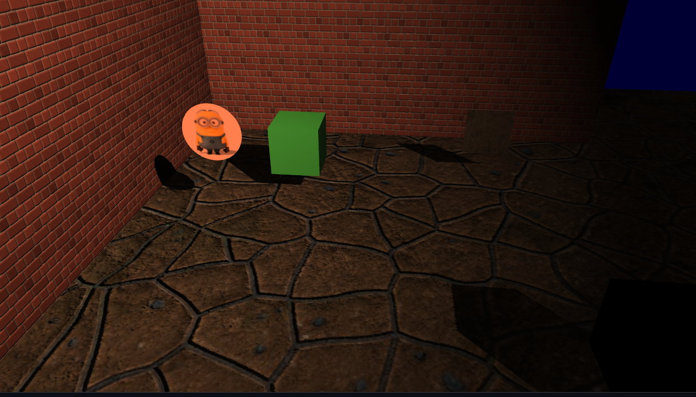
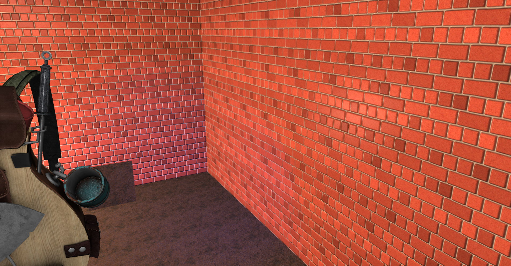
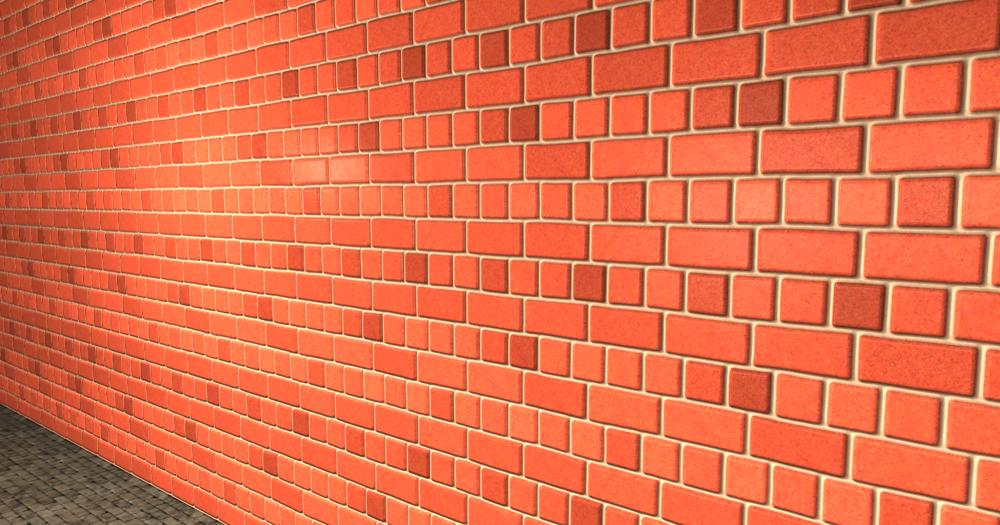
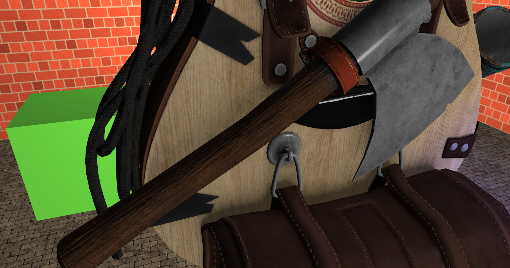
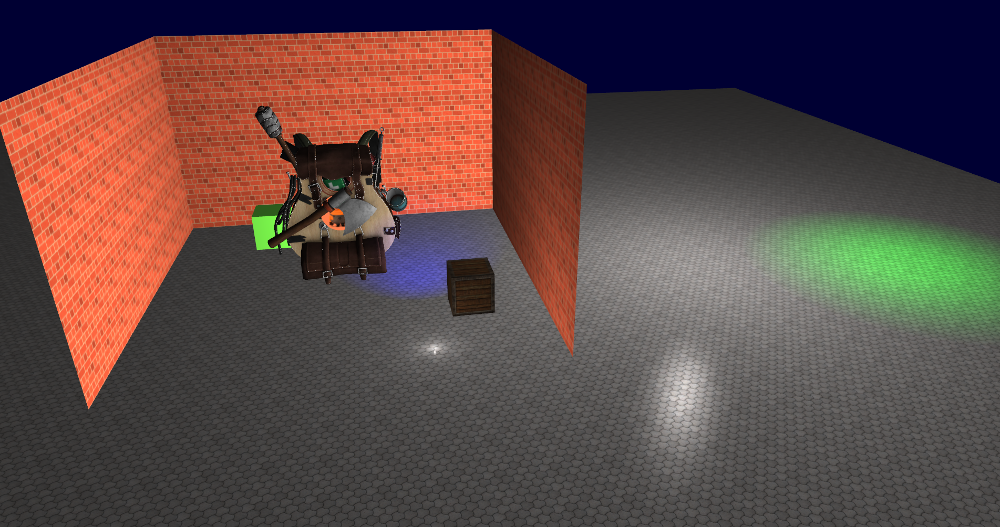
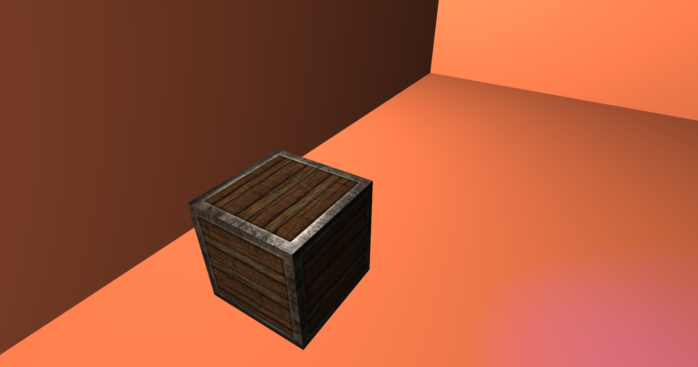
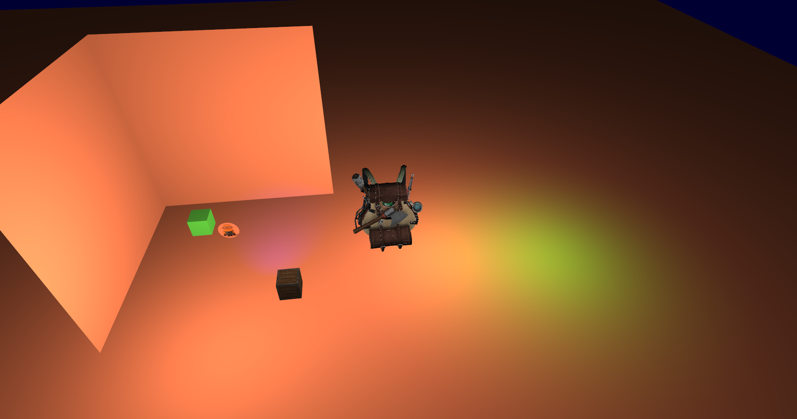
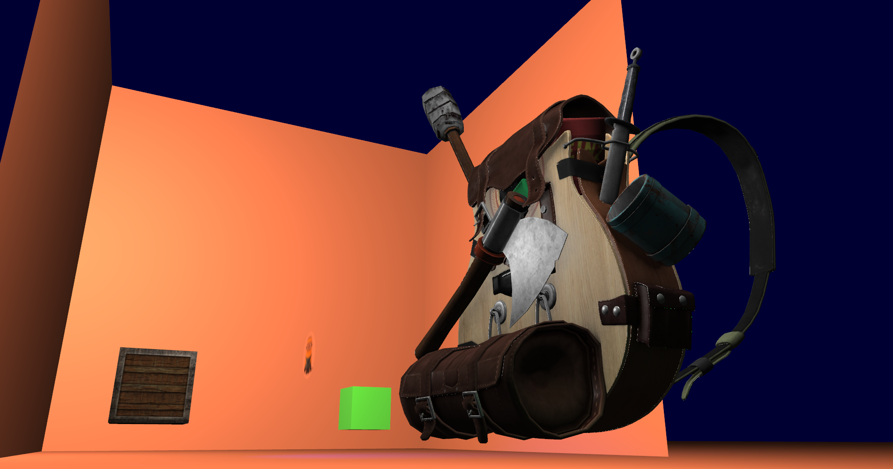
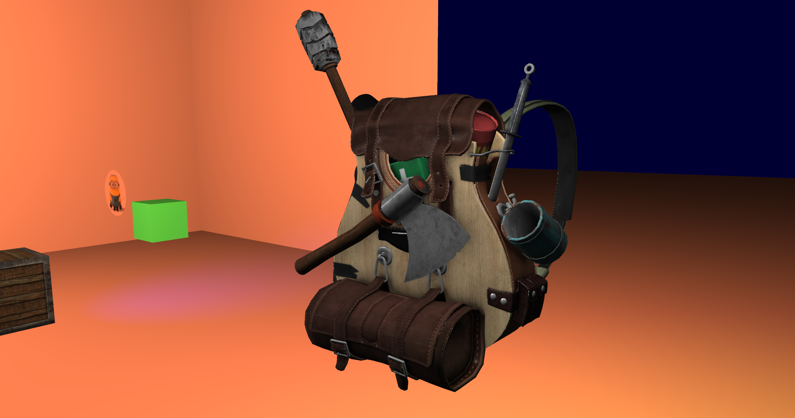
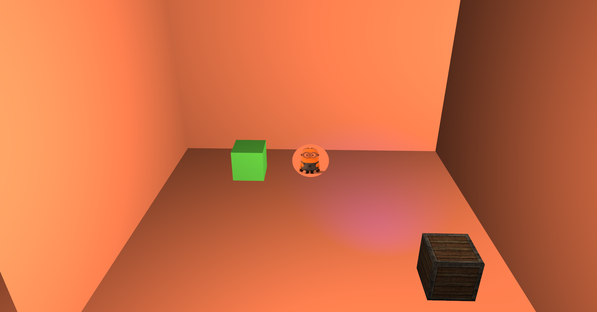

# BSP_OpenGL_Course

OpenGL Course

Shadow Rendering

Parallax Mapping

WIP: Parallax Mapping

Specular Reflection

Normal Mapping

Lighting ( Directional, Point and SpotLight )

Obj Model loading using Assimp

